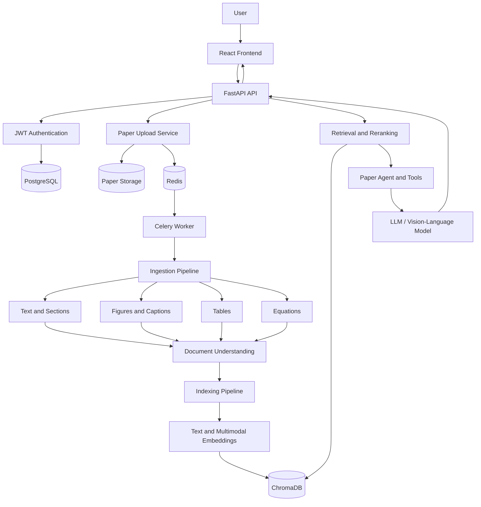

# 📄 PaperQA

> A multimodal research-paper assistant that retrieves and reasons across text, figures, tables, captions, equations, and their relationships.

PaperQA is a full-stack multimodal Retrieval-Augmented Generation application for understanding research papers. A user uploads a PDF, waits while it is parsed and indexed, and then asks questions through a conversational interface. The system retrieves grounded evidence from the paper and returns answers with page-, figure-, and table-level citations.

PaperQA is inspired by the clean engineering workflow of projects such as RepoSage, but it is designed for the deeper structure of research papers rather than source-code repositories.

---

## 🚧 Project Status

PaperQA is under active development. The repository currently contains the initial backend and frontend skeleton. The architecture and development path are defined below, but the complete system is not implemented yet.

### Current milestone

**Milestone 1 — Backend foundation**

- [x] Initial repository structure
- [x] Target architecture defined
- [x] Development roadmap defined
- [ ] FastAPI application starts successfully
- [ ] Environment-based configuration
- [ ] PostgreSQL connection
- [ ] Health endpoint
- [ ] First backend test

### Product progress

- [ ] User registration and JWT login
- [ ] Paper upload and ownership
- [ ] Page-level text extraction
- [ ] Text chunking and embeddings
- [ ] ChromaDB indexing
- [ ] Grounded text RAG with page citations
- [ ] Celery + Redis background indexing
- [ ] Figure and caption extraction
- [ ] Table extraction and normalization
- [ ] Equation extraction and explanation
- [ ] Multimodal retrieval
- [ ] Vision-language answer generation
- [ ] Tool-using paper agent
- [ ] React login, upload, and chat flow
- [ ] Plotly visualizations
- [ ] Automated evaluation
- [ ] Docker Compose
- [ ] GitHub Actions CI
- [ ] Deployment

---

## 🎯 Product Goal

PaperQA should help a reader answer questions such as:

- What is the main contribution of this paper?
- Explain the methodology in simple language.
- What does Figure 3 demonstrate?
- Compare the models in Table 2.
- Explain Equation 6 using the surrounding text.
- Which result supports the authors' main claim?
- Plot the accuracy values reported in Table 4.
- How are Figure 2, Section 4, and Table 3 related?

The final system must not treat the PDF as plain text only. It should preserve the paper's structure and connect related content across sections, pages, figures, tables, captions, and equations.

---

## ✨ Planned Capabilities

### Version 1 — Full-stack text PaperQA

- User registration and JWT authentication
- PDF upload and paper ownership
- Asynchronous indexing using Celery and Redis
- Page-aware text extraction
- Semantic chunking and dense embeddings
- ChromaDB retrieval filtered by paper
- Grounded answers with page citations
- React interface for login, upload, status, and chat

### Version 1.x — Multimodal PaperQA

- Figure extraction with captions and surrounding text
- Table extraction with structured data preservation
- Equation extraction and contextual explanation
- Figure, table, and equation descriptions
- Multimodal retrieval across multiple content types
- Actual image input to a vision-language model
- Figure-, table-, and page-level citations
- Plotly charts generated from retrieved tables

### Later versions

- Tool-using agent for complex questions
- Conversation memory backed by Redis or PostgreSQL
- Hybrid retrieval and reranking
- Document relationship graph
- Open-source VLM and local embedding support
- Multi-paper comparison
- Visual retrieval for scanned PDFs
- Retrieval and citation evaluation dashboard

---

## 🏗️ Target Architecture



### System responsibilities

1. **API and identity** — authentication, paper ownership, requests, and responses.
2. **Ingestion** — parse PDF pages into text, figures, tables, equations, and metadata.
3. **Understanding** — connect captions, mentions, sections, and surrounding context.
4. **Indexing** — create content-specific chunks and embeddings.
5. **Retrieval** — understand the query, search appropriate modalities, filter, and rerank.
6. **Generation** — build grounded prompts, attach images when necessary, and produce cited answers.
7. **Visualization** — convert retrieved tabular data into Plotly chart specifications.
8. **Evaluation** — measure retrieval quality, grounding, and citation correctness.

---

## 🧰 Tech Stack

| Layer | Technology | Purpose |
|---|---|---|
| Backend API | FastAPI | REST API and interactive OpenAPI documentation |
| Database | PostgreSQL | Users, papers, ingestion jobs, sessions, and metadata |
| ORM | SQLAlchemy | Database models and queries |
| Migrations | Alembic | Versioned database schema changes |
| Authentication | JWT + password hashing | Protected multi-user access |
| Async jobs | Celery + Redis | Long-running extraction and indexing |
| PDF parsing | PyMuPDF + pdfplumber | Text, figures, coordinates, and tables |
| Vector database | ChromaDB | Embeddings and metadata-filtered retrieval |
| Embeddings | Configurable provider | Text and query representations |
| LLM / VLM | Configurable provider | Text and image-grounded answer generation |
| Visualization | Pandas + Plotly | Charts from structured table data |
| Frontend | React + Vite | Login, dashboard, upload, progress, and chat |
| HTTP client | Axios | Frontend-to-backend requests |
| Testing | Pytest | Unit and API tests |
| Infrastructure | Docker Compose | API, worker, Redis, PostgreSQL, and frontend |
| CI | GitHub Actions | Tests, builds, and validation on every change |

Model names and providers will be configured through environment variables rather than hardcoded into the application.

---

## 📁 Target Project Structure

```text
PaperQA/
├── backend/
│   ├── app/
│   │   ├── api/
│   │   │   ├── routes/
│   │   │   │   ├── health.py
│   │   │   │   ├── auth.py
│   │   │   │   ├── papers.py
│   │   │   │   ├── ingestion.py
│   │   │   │   ├── status.py
│   │   │   │   ├── chat.py
│   │   │   │   ├── figures.py
│   │   │   │   └── tables.py
│   │   │   ├── schemas/
│   │   │   │   ├── auth.py
│   │   │   │   ├── paper.py
│   │   │   │   ├── ingestion.py
│   │   │   │   ├── chat.py
│   │   │   │   └── source.py
│   │   │   └── dependencies.py
│   │   │
│   │   ├── core/
│   │   │   ├── config.py
│   │   │   ├── security.py
│   │   │   ├── exceptions.py
│   │   │   ├── logging.py
│   │   │   └── celery_app.py
│   │   │
│   │   ├── database/
│   │   │   ├── base.py
│   │   │   ├── session.py
│   │   │   ├── models/
│   │   │   │   ├── user.py
│   │   │   │   ├── paper.py
│   │   │   │   ├── ingestion_job.py
│   │   │   │   ├── chat_session.py
│   │   │   │   ├── message.py
│   │   │   │   ├── figure.py
│   │   │   │   └── table.py
│   │   │   └── repositories/
│   │   │       ├── user_repository.py
│   │   │       ├── paper_repository.py
│   │   │       └── chat_repository.py
│   │   │
│   │   ├── domain/
│   │   │   ├── entities/
│   │   │   │   ├── document.py
│   │   │   │   ├── content_block.py
│   │   │   │   ├── figure.py
│   │   │   │   ├── table.py
│   │   │   │   └── retrieval_result.py
│   │   │   ├── enums/
│   │   │   │   ├── content_type.py
│   │   │   │   ├── paper_status.py
│   │   │   │   └── job_status.py
│   │   │   └── value_objects/
│   │   │       └── source_reference.py
│   │   │
│   │   ├── ingestion/
│   │   │   ├── pipeline.py
│   │   │   ├── document_loader.py
│   │   │   ├── text_extractor.py
│   │   │   ├── figure_extractor.py
│   │   │   ├── table_extractor.py
│   │   │   ├── caption_extractor.py
│   │   │   ├── equation_extractor.py
│   │   │   └── validators.py
│   │   │
│   │   ├── understanding/
│   │   │   ├── section_detector.py
│   │   │   ├── caption_linker.py
│   │   │   ├── figure_text_linker.py
│   │   │   ├── table_text_linker.py
│   │   │   ├── reading_order.py
│   │   │   ├── image_describer.py
│   │   │   ├── table_summarizer.py
│   │   │   └── document_graph.py
│   │   │
│   │   ├── indexing/
│   │   │   ├── chunkers/
│   │   │   │   ├── text_chunker.py
│   │   │   │   ├── figure_chunker.py
│   │   │   │   └── table_chunker.py
│   │   │   ├── embeddings/
│   │   │   │   ├── embedding_factory.py
│   │   │   │   ├── text_embeddings.py
│   │   │   │   └── image_embeddings.py
│   │   │   ├── vector_store/
│   │   │   │   ├── chroma_client.py
│   │   │   │   └── collections.py
│   │   │   └── index_pipeline.py
│   │   │
│   │   ├── retrieval/
│   │   │   ├── query_analyzer.py
│   │   │   ├── dense_retriever.py
│   │   │   ├── multimodal_retriever.py
│   │   │   ├── metadata_filter.py
│   │   │   ├── reranker.py
│   │   │   ├── context_builder.py
│   │   │   └── citation_builder.py
│   │   │
│   │   ├── agent/
│   │   │   ├── agent.py
│   │   │   ├── state.py
│   │   │   ├── prompts.py
│   │   │   ├── tool_registry.py
│   │   │   └── tools/
│   │   │       ├── search_paper.py
│   │   │       ├── get_page.py
│   │   │       ├── get_section.py
│   │   │       ├── get_figure.py
│   │   │       ├── get_table.py
│   │   │       ├── explain_equation.py
│   │   │       └── create_chart.py
│   │   │
│   │   ├── generation/
│   │   │   ├── model_factory.py
│   │   │   ├── prompt_builder.py
│   │   │   ├── text_generator.py
│   │   │   ├── vision_generator.py
│   │   │   ├── response_parser.py
│   │   │   ├── citation_validator.py
│   │   │   └── grounding_checker.py
│   │   │
│   │   ├── visualization/
│   │   │   ├── intent.py
│   │   │   ├── table_normalizer.py
│   │   │   ├── chart_selector.py
│   │   │   └── plotly_builder.py
│   │   │
│   │   ├── storage/
│   │   │   ├── file_storage.py
│   │   │   ├── paper_storage.py
│   │   │   ├── figure_storage.py
│   │   │   └── paths.py
│   │   │
│   │   ├── workers/
│   │   │   ├── progress.py
│   │   │   └── tasks/
│   │   │       ├── ingest_paper.py
│   │   │       ├── generate_descriptions.py
│   │   │       └── delete_paper.py
│   │   │
│   │   ├── observability/
│   │   │   ├── metrics.py
│   │   │   └── tracing.py
│   │   │
│   │   └── main.py
│   │
│   ├── tests/
│   ├── migrations/
│   ├── scripts/
│   ├── storage/
│   ├── Dockerfile
│   └── requirements.txt
│
├── frontend/
│   ├── public/
│   ├── src/
│   │   ├── components/
│   │   │   ├── PaperUpload.jsx
│   │   │   ├── IngestionProgress.jsx
│   │   │   ├── ChatWindow.jsx
│   │   │   ├── SourceViewer.jsx
│   │   │   ├── FigureViewer.jsx
│   │   │   └── Visualization.jsx
│   │   ├── pages/
│   │   │   ├── Login.jsx
│   │   │   ├── Register.jsx
│   │   │   ├── Dashboard.jsx
│   │   │   └── PaperChat.jsx
│   │   ├── services/
│   │   │   └── api.js
│   │   ├── context/
│   │   │   └── AuthContext.jsx
│   │   ├── App.jsx
│   │   └── main.jsx
│   ├── Dockerfile
│   ├── package.json
│   └── vite.config.js
│
├── evaluation/
│   ├── datasets/
│   ├── metrics/
│   ├── reports/
│   └── run_evaluation.py
│
├── experiments/
│   ├── pdf_parsing/
│   ├── chunking/
│   ├── embeddings/
│   ├── retrieval/
│   └── vlm/
│
├── docs/
│   ├── architecture/
│   └── screenshots/
│
├── infrastructure/
├── .github/workflows/ci.yml
├── docker-compose.yml
├── .env.example
├── .gitignore
├── LICENSE
└── README.md
```

This is the target structure, not a requirement to create every empty file immediately. Directories will be introduced only when their milestone begins.

---

## 🧠 Unified Content Model

Every extracted item will eventually be represented as a structured content block.

```json
{
  "id": "block-id",
  "paper_id": "paper-id",
  "content_type": "text",
  "page_number": 5,
  "content": "The proposed method uses...",
  "bounding_box": [72, 110, 510, 350],
  "metadata": {
    "section": "Methodology",
    "figure_number": null,
    "table_number": null
  }
}
```

Planned content types:

```text
TITLE
HEADING
TEXT
CAPTION
FIGURE
TABLE
EQUATION
REFERENCE
```

This shared representation allows text, visual elements, and their relationships to move through the same ingestion, indexing, retrieval, citation, and evaluation pipeline.

---

## 🔬 How PaperQA Will Work

### 1. Upload and background ingestion

```text
Authenticated user uploads PDF
        ↓
FastAPI validates and saves the file
        ↓
Paper and ingestion-job records are created
        ↓
Celery task is queued through Redis
        ↓
Frontend polls the job-status endpoint
```

### 2. Structured document extraction

```text
PDF pages
 ├── Text blocks and headings
 ├── Figures and coordinates
 ├── Captions
 ├── Tables and structured cells
 ├── Equations
 └── Page metadata
        ↓
Normalized content blocks
```

### 3. Document understanding

```text
Caption ↔ Figure
Caption ↔ Table
Paragraph ↔ Figure mention
Paragraph ↔ Table mention
Equation ↔ Surrounding explanation
Section ↔ Child content blocks
```

The long-term output is a relationship graph that preserves how the paper's components support one another.

### 4. Content-specific indexing

```text
Text       → semantic chunks
Figure     → caption + VLM description + image metadata
Table      → structured data + summary
Equation   → expression + nearby explanation
        ↓
Embeddings + metadata
        ↓
ChromaDB
```

### 5. Multimodal question answering

```text
Question
   ↓
Query analysis and intent detection
   ↓
Retrieve relevant text, figures, tables, or equations
   ↓
Filter by paper and rerank
   ↓
Build grounded context
   ↓
Attach original images when required
   ↓
LLM / VLM answer generation
   ↓
Citation validation
   ↓
Answer + sources + optional visualization
```

---

## 🧰 Planned Agent Tools

The agent layer will be added only after deterministic RAG works reliably.

| Tool | Purpose |
|---|---|
| `search_paper` | Search relevant text, figures, tables, and equations |
| `get_page` | Return all extracted content from one page |
| `get_section` | Return a paper section and its child content |
| `get_figure` | Return image, caption, description, and nearby discussion |
| `get_table` | Return structured table data and related text |
| `explain_equation` | Retrieve an equation and its contextual explanation |
| `create_chart` | Generate a Plotly specification from table data |
| `summarize_paper` | Produce a structured paper overview |

---

## 🔌 Planned API

### Health

| Method | Endpoint | Description |
|---|---|---|
| `GET` | `/health` | Check API availability |

### Authentication

| Method | Endpoint | Description |
|---|---|---|
| `POST` | `/api/auth/register` | Create an account |
| `POST` | `/api/auth/login` | Receive an access token |
| `GET` | `/api/auth/me` | Read the current user |

### Papers

| Method | Endpoint | Description |
|---|---|---|
| `POST` | `/api/papers/upload` | Upload and queue a PDF |
| `GET` | `/api/papers` | List the current user's papers |
| `GET` | `/api/papers/{paper_id}` | Read paper metadata |
| `DELETE` | `/api/papers/{paper_id}` | Delete a paper and its indexed data |

### Processing

| Method | Endpoint | Description |
|---|---|---|
| `GET` | `/api/jobs/{job_id}` | Poll ingestion progress |

### Chat

| Method | Endpoint | Description |
|---|---|---|
| `POST` | `/api/papers/{paper_id}/chat` | Ask a question about one paper |
| `GET` | `/api/papers/{paper_id}/sessions` | List chat sessions |
| `GET` | `/api/sessions/{session_id}/messages` | Read conversation history |

### Paper content

| Method | Endpoint | Description |
|---|---|---|
| `GET` | `/api/papers/{paper_id}/pages/{page_number}` | Read page-level content |
| `GET` | `/api/papers/{paper_id}/figures/{figure_id}` | Load figure details and image |
| `GET` | `/api/papers/{paper_id}/tables/{table_id}` | Load table details and data |

---

## 🗺️ Development Plan

### Milestone 1 — Backend foundation

- FastAPI application
- Pydantic settings
- Logging
- PostgreSQL and SQLAlchemy setup
- Health endpoint
- First Pytest test

**Definition of done:** `/health` and `/docs` work, the database connection is configured, and the first test passes.

### Milestone 2 — Authentication and ownership

- User model
- Registration and login
- Password hashing
- JWT creation and verification
- Protected routes

**Definition of done:** a user can register, log in, and access `/api/auth/me` with a token.

### Milestone 3 — Paper upload

- Paper and ingestion-job models
- PDF validation
- Local paper storage
- Paper ownership
- Initial upload endpoint

**Definition of done:** a valid PDF is stored and represented by a database record owned by the authenticated user.

### Milestone 4 — Text extraction and text RAG

- Page-level extraction
- Section-aware chunking
- Embeddings
- ChromaDB indexing
- Dense retrieval
- Answer generation
- Page citations

**Definition of done:** upload → index → ask → receive a grounded answer with page sources.

### Milestone 5 — Asynchronous indexing

- Redis
- Celery worker
- Progress updates
- Job-status endpoint
- Retry and failure handling

**Definition of done:** slow indexing no longer blocks the API, and the client can track progress.

### Milestone 6 — React frontend

- Registration and login
- Dashboard
- PDF upload
- Progress polling
- Chat interface
- Source viewer

**Definition of done:** the complete login → upload → index → chat flow works in the browser.

### Milestone 7 — Multimodal extraction

- Figures
- Captions
- Tables
- Equations
- Coordinates and surrounding context
- Relationship linking

**Definition of done:** PaperQA can reliably retrieve the correct visual or structured item for direct questions.

### Milestone 8 — VLM and multimodal retrieval

- Figure and table descriptions
- Image-aware context building
- Vision-language model requests
- Figure and table citations
- Multimodal reranking

**Definition of done:** questions about figures and tables use the actual relevant visual evidence.

### Milestone 9 — Agent and visualization

- Tool registry
- Query planning
- Page, section, figure, table, equation, and chart tools
- Plotly chart generation
- Conversation memory

**Definition of done:** the agent chooses appropriate tools for complex requests and can produce grounded visualizations.

### Milestone 10 — Evaluation and production

- Retrieval dataset
- Citation metrics
- Groundedness checks
- Docker Compose
- GitHub Actions CI
- Deployment
- Monitoring and tracing

**Definition of done:** quality is measurable, builds are reproducible, tests run automatically, and the application can be deployed safely.

---

## 🧪 Evaluation Strategy

A serious RAG system must be measured, not only demonstrated.

Planned evaluation dimensions:

- **Retrieval recall** — was the correct page, figure, or table retrieved?
- **Ranking quality** — how high did the correct source appear?
- **Citation accuracy** — does each citation support the generated claim?
- **Groundedness** — is the answer supported by the uploaded paper?
- **Answer relevance** — did the response address the actual question?
- **Multimodal correctness** — was the correct image or table supplied to the VLM?
- **Latency** — ingestion time, retrieval time, and generation time.

The `evaluation/` directory will contain fixed questions and expected sources so improvements can be compared objectively.

---

## ⚙️ Environment Variables

The final `.env.example` will use variables such as:

```env
APP_NAME=PaperQA
APP_ENV=development
DEBUG=true

DATABASE_URL=postgresql+psycopg://paperqa:paperqa@db:5432/paperqa

JWT_SECRET_KEY=replace-with-a-secure-random-secret
JWT_ALGORITHM=HS256
ACCESS_TOKEN_EXPIRE_MINUTES=60

REDIS_URL=redis://redis:6379/0
CELERY_BROKER_URL=redis://redis:6379/0
CELERY_RESULT_BACKEND=redis://redis:6379/1

AI_PROVIDER=openai
LLM_MODEL=
VISION_MODEL=
EMBEDDING_MODEL=text-embedding-3-small
OPENAI_API_KEY=

PAPER_STORAGE_DIR=storage/papers
FIGURE_STORAGE_DIR=storage/figures
TABLE_STORAGE_DIR=storage/tables
CHROMA_PERSIST_DIR=storage/chroma

VITE_API_URL=http://localhost:8000
```

Real secrets must never be committed. Only `.env.example` belongs in version control.

---

## 🐳 Planned Local Services

Docker Compose will eventually start:

```text
frontend
api
worker
redis
postgres
```

ChromaDB will initially use embedded persistent storage mounted as a Docker volume. The storage layer will be designed so local files can later be replaced by S3 or compatible object storage.

---

## 🔄 CI/CD Plan

### Continuous Integration

Every push and pull request will run:

1. Backend dependency installation
2. Backend linting and tests
3. Frontend dependency installation
4. Frontend linting and production build
5. Docker build validation

### Continuous Deployment

Deployment will be added only after CI is stable. Production deployment will run from the protected `main` branch and use environment-specific secrets.

---

## ⚠️ Current Limitations

- The repository is currently an early scaffold.
- Most backend services are not implemented.
- The frontend entry files and package configuration are incomplete.
- Authentication and database models are not implemented.
- PDF indexing and ChromaDB retrieval are not implemented.
- Multimodal extraction and VLM calls are not implemented.
- Evaluation and production deployment are planned, not current capabilities.

These limitations will be updated as each milestone is completed.

---

## 📌 Engineering Principles

- Build one tested vertical milestone at a time.
- Keep API routes thin; business logic belongs in services.
- Keep SQLAlchemy models separate from Pydantic schemas.
- Preserve page numbers, coordinates, content types, and source relationships.
- Never generate an uncited factual answer when evidence is unavailable.
- Keep AI providers configurable.
- Do not introduce an agent before deterministic retrieval works.
- Add tests with every feature.
- Measure retrieval and citation quality before claiming improvement.
- Keep the README aligned with what is actually implemented.

---

## 📄 License

This project is planned to be released under the MIT License.

---

## 🙏 Inspiration

- RepoSage — reference for a clear full-stack RAG development workflow
- PyMuPDF and pdfplumber — PDF parsing foundations
- ChromaDB — vector retrieval
- FastAPI, Celery, Redis, PostgreSQL, React, and Plotly — application infrastructure

---

## 🚀 Next Task

The next implementation task is **Milestone 1: Backend foundation**.

```text
Create dependency file
→ configure application settings
→ configure PostgreSQL and SQLAlchemy
→ add /health
→ add the first Pytest test
→ run FastAPI and tests
→ commit the milestone
```


Libraries you can use as a reference
FastAPI
Uvicorn
Pydantic
SQLAlchemy
Alembic
Psycopg
PyMuPDF
Docling
pdfplumber
PaddleOCR
Pillow
Pandas
Plotly
Sentence Transformers
Qdrant
ChromaDB
rank-bm25
Celery
Redis
boto3
Pytest
HTTPX
Structlog
OpenTelemetry
React
Vite
Axios
TanStack Query
Zustand

# Setup Troubleshooting (Windows)

This document records real problems hit while setting up the backend on
Windows, and the fixes — so future setup is faster and nobody repeats
the same detours.

## Recommended setup (skip straight to this)

- **Python 3.12** — https://www.python.org/downloads/release/python-3120/
  (not 3.14+ — see "Wrong Python version" below)
- **PostgreSQL 18**, native Windows install —
  https://www.postgresql.org/download/windows/
- **pgAdmin 4** — installed automatically alongside PostgreSQL, used to
  create the database/role (no command line required)
- **No Docker, no WSL** needed for local development. Docker only
  becomes useful later, for deployment (Milestone 10+).

## Things that went wrong

### Attempt 1: Docker Desktop for Postgres — abandoned

1. Downloaded Docker Desktop from
   https://www.docker.com/products/docker-desktop/
2. Accidentally downloaded the **ARM64** build instead of **AMD64/x64**.
   - Error: *"This app can't run on your PC"*
   - Fix: check Settings → System → About → "System type" before
     downloading. Most Windows PCs are x64, not ARM. Re-download the
     correct AMD64 installer.
3. After installing the correct x64 build, Docker Desktop required
   WSL2 (Windows Subsystem for Linux), which wasn't installed.
   - Error: *"WSL not installed"*
4. Fixing this meant running `wsl --install` in an admin PowerShell,
   restarting Windows, and dealing with a separate Ubuntu terminal
   window — a lot of moving parts for something local dev doesn't
   actually need.
5. **Decision:** abandoned Docker/WSL for local dev entirely. It adds
   real value later for deployment, but not here.

### Attempt 2 (what we actually used): native PostgreSQL install

1. Downloaded PostgreSQL 18 from
   https://www.postgresql.org/download/windows/ → "Download the
   installer" → EnterpriseDB Windows x86-64 build.
2. Ran the `.exe` like a normal installer:
   - Set a password for the `postgres` superuser (remember it)
   - Kept default port `5432`
   - Kept default locale
3. At the end it launched **Stack Builder** (optional extra downloads)
   — clicked **Cancel**, not needed for us.
4. Verified it was running via Windows **Services** app
   (`postgresql-x64-18` → status **Running**).
5. Used **pgAdmin 4** (bundled with the installer) to create the
   `paperqa` login role and `paperqa` database — no command line
   needed.

### Also hit: wrong Python version

- Started with Python 3.14 (very new at the time). `pydantic-core`
  (a Rust-based dependency) had no prebuilt wheel for 3.14 yet, so pip
  tried to compile it from source, which then failed needing a Rust
  toolchain *and* the MSVC linker (`link.exe`), neither installed.
- **Fix:** use Python 3.12 instead — much wider prebuilt wheel
  availability across the ecosystem. This matters even more in later
  milestones (PyMuPDF, PaddleOCR, sentence-transformers, ChromaDB all
  lag on brand-new Python versions).

## Quick reference

| Tool | Version | Link |
|---|---|---|
| Python | 3.12 | https://www.python.org/downloads/release/python-3120/ |
| PostgreSQL | 18 (native Windows install) | https://www.postgresql.org/download/windows/ |
| pgAdmin 4 | bundled with PostgreSQL installer | — |